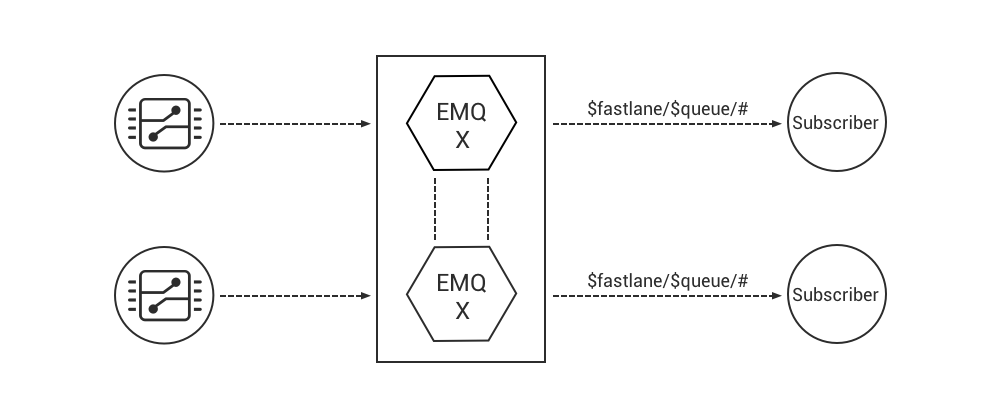

.. _overview:

========
Overview
========

EMQ is a distributed, massively scalable, highly extensible MQTT message broker which can sustain million level connections. It is chosen by more than 3000 enterprises worldwide. More than 10,000 nodes are deployed and serve 30 million mobile and IoT connections.

EMQ X is the enterprise edition of the EMQ broker which extends the function and performance of EMQ. It improves the system architecture of EMQ, adopts Scalable RPC mechanism, provides more reliable clustering and higher performance of message routing.

EMQ X supports persistence MQTT messages to Redis , MySQL, PostgreSQL, MongoDB, Cassandra and other databases. It also supports bridging and forwarding MQTT messages to enterprise messaging middleware like Kafka and RabbitMQ.

EMQ X can be used as scalable, reliable, enterprise-grade access platform for IoT, M2M, smart hardware, smart home and mobile messaging applications that serve millions of device terminals.

.. image:: _static/images/emqx_enterprise.png

----------------
Design Objective
----------------

EMQ (Erlang MQTT Broker) is an open source MQTT broker written in Erlang/OTP. Erlang/OTP is a concurrent, fault-tolerant, soft-realtime and distributed programming platform. MQTT is an extremely lightweight publish/subscribe messaging protocol powering IoT, M2M and Mobile applications.

The design objectives of EMQ X focus on enterprise-level requirements, such as high reliability, massive connections and extremely low latency of message delivery.

1. Steadily sustains massive MQTT client connections. A single node is able to handles about 1 million connections.

2. Distributed clustering, low-latency message routing. Single cluster handles 10 million level subscriptions.

3. Extensible broker design. Allow customizing various Auth/ACL extensions and data persistence extensions.

4. Supports comprehensive IoT protocols: MQTT, MQTT-SN, CoAP, WebSocket and other proprietary protocols.

--------
Features
--------

1. Scalable RPC Architecture: segregated cluster management channel and data channel between nodes.

2. Fastlane subscription: dedicated Fastlane message routing for IoT data collection.

3. Persistence to Redis: subscriptions, client connection status, MQTT messages, retained messages, SUB/UNSUB events.

4. Persistence to MySQL: subscriptions, client connection status, MQTT messages, retained messages.
   
5. Persistence to PostgreSQL: subscriptions, client connection status, MQTT messages, retained messages.
 
6. Persistence to MongoDB: subscriptions, client connection status, MQTT messages, retained messages.

7. Bridge to Kafka: EMQ X forwards MQTT messages, client connected/disconnected event to Kafka.

8. Bridge to RabbitMQ: EMQ X forwards MQTT messages, client connected/disconnected event to RabbitMQ.

.. _scalable_rpc:

-------------------------
Scalable RPC Architecture
-------------------------

EMQ X improves the communication mechanism between distributed nodes, segregates the cluster management channel and the data channel, and greatly improved the message throughput and the cluster reliability.

.. NOTE:: the dash line indicates the cluster management and the solid line indicates the data exchange.

.. image:: _static/images/scalable_rpc.png

Scalable RPC configuration::

    ## TCP server port.
    rpc.tcp_server_port = 5369

    ## Default TCP port for outgoing connections
    rpc.tcp_client_port = 5369

    ## Client connect timeout
    rpc.connect_timeout = 5000

    ## Client and Server send timeout
    rpc.send_timeout = 5000

    ## Authentication timeout
    rpc.authentication_timeout = 5000

    ## Default receive timeout for call() functions
    rpc.call_receive_timeout = 15000

    ## Socket keepalive configuration
    rpc.socket_keepalive_idle = 7200

    ## Seconds between probes
    rpc.socket_keepalive_interval = 75

    ## Probes lost to close the connection
    rpc.socket_keepalive_count = 9

.. NOTE:: If firewalls are deployed between nodes, the 5369 port on each node must be opened.

.. _fastlane:

---------------------
Fastlane Subscription
---------------------

EMQ X supports Fastlane Subscription, it can greatly enhance the message routing efficiency and is thus very suitable for big data collection of IoT applications.

.. image:: _static/images/fastlane.png

Fastlane usage: *$fastlane/<Topic>*

Fastlane limitations:

1. CleanSession = true
2. Qos = 0

Fastlane subscription is suitable for IoT sensor data collection:

----------------------
Subscription by Broker
----------------------

EMQ X supports subscription by broker. A client does not need an explicit subscribes action and will get some topics subscribed. The EMQ X broker will subscribe specified topics on behalf of the client. The topics are loaded from Redis or databases.

EMQ X subscription by broker is suitable for devices requiring low power consumption and narrow network bandwidth. The feature brings convenience to massive device management too.

---------------------
MQTT Data Persistence
---------------------

EMQ X supports MQTT data (subscription, messages, client online/offline status) persistence to Redis, MySQL, PostgreSQL, MongoDB and Cassandra databases:

.. image:: _static/images/storage.png

For details please refer to the "Backends" chapter.

------------------------
Message Bridge & Forward 
------------------------

EMQ X allows bridging and forwarding MQTT messages to message-oriented middleware such as RabbitMQ and Kafka. It can be deployed as an IoT Hub:

.. image:: _static/images/iothub.png

